# The test automation project for [ITFinland website](https://itfinland.com/)


___

## The project is prepared with technologies:

<p  align="center"

<code>


</code>
</p>


___

## The list of tests grouped by tag parameter:

**"all_tests"** - includes all tests in the project (tags "main_page" and "top_menu"):

<details>
<summary>"main_page" - smoke tests:</summary>

+ Page title should have header 'ITFinland'
+ Check Main page is displayed
+ Check the top menu contains 3 items
+ Check the button for opening the Application form
+ Page console log should not have errors

</details>

<details>
<summary>"top_menu" - tests for top menu items:</summary>

+ Check the 'For companies' item
+ Check the 'For IT professionals' item
+ Check the 'Contact us' item

</details>


___

## Run tests from terminal locally

### Run tests with filled remote properties:

```bash
gradle clean test
```

### Run tests without filled remote properties:

```bash
gradle clean
test
-Dtag=${tag}
-Denvironment=${ENVIRONMENT}
-Dbrowser=${BROWSER}
-DbrowserVersion=${BROWSER_VERSION}
-DbrowserSize=${BROWSER_SIZE}
-DbrowserMobileView=${BROWSER_MOBILE}
-DURL=${REMOTE_DRIVER_URL}
-DvideoStorage=https://${REMOTE_DRIVER_URL}/video/
-Dthreads=${THREADS}
```

where:
> + tag - :point_up: [The list of tests grouped by tag parameter](#the-list-of-tests-grouped-by-tag-parameter) for select suites tests, which will be runned in the build (by default - all_tests)
> + environment - environment, where build will be runned:
>   * `prod` - production (by default)
>   * `dev` - staging for development
> + browser - browser for running tests (by default - chrome)
> + browserVersion - version of selected browser (by default - 91.0)
> + browserSize - size of selected browser (by default - 1920x1080)
> + browserMobileView - phone model for running mobile tests (by default - empty)
> + URL - address of remote server, where build will be runned (by default - selenoid.autotests.cloud)
> + videoStorage - storage of runned tests videos (by default - selenoid.autotests.cloud/video/)
> + threads - the number of threads for running tests (by default - 5)

### Serve report:

```bash
allure serve build/allure-results
```


___

## Results analysis

The test results can be found in:
+ [Jenkins](#jenkins)
+ [Allure Report](#allure-report)
+ [Allure TestOps](#allure-testOps)
+ [Jira](#jira)


### [Jenkins](https://jenkins.autotests.cloud/job/09-elenakomarova-itfinland-project-ui/build?delay=0sec)

For the running autotests in Jenkins, you can specify the parameters described
in :point_up:  [Run tests without filled remote properties](#run-tests-without-filled-remote-properties).

After selecting the necessary parameters, you need to click the Submit (Собрать) button.

<p align="center">
  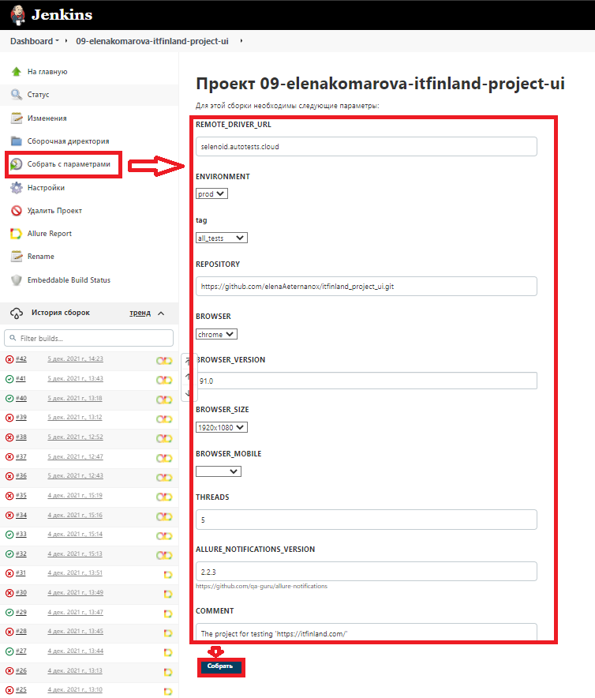
</p>

After the finish of launch you may watch statistics and open
the `Allure Report` 

<p align="center">
  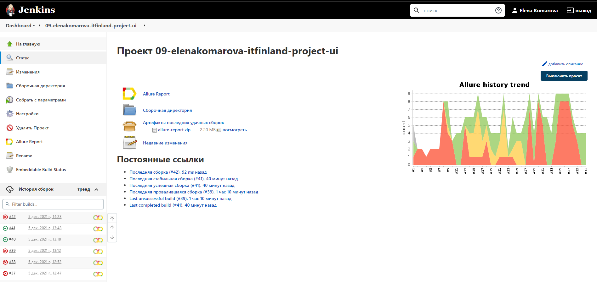
</p>

### Allure Report

It's the examples of report about test build with grouping by tags (:point_up: [The list of tests grouped by tag parameter](#the-list-of-tests-grouped-by-tag-parameter))

 :arrow_right: [The launch with results for tag = main_page](https://jenkins.autotests.cloud/job/09-elenakomarova-itfinland-project-ui/32/allure/)

<p align="center">
  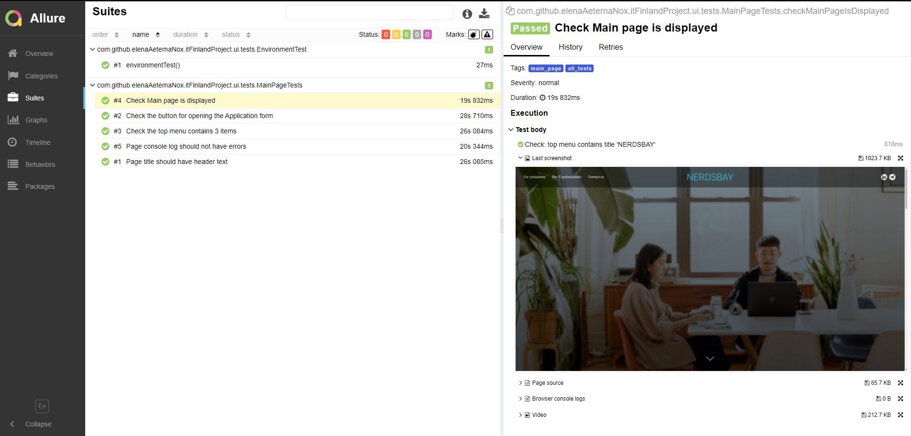
</p>

:arrow_right: [The launch with results for tag = top_menu](https://jenkins.autotests.cloud/job/09-elenakomarova-itfinland-project-ui/33/allure/)

<p align="center">
  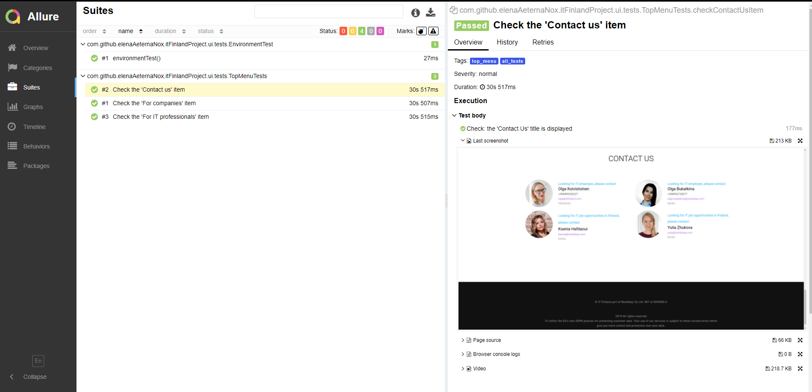
</p>

### Allure TestOps

Allure TestOps is used as a storage for all tests cases (automated and manual), launches, their results. You may watch statistic and reports by all launches and results

:arrow_right: Dashboard:

<p align="center">
  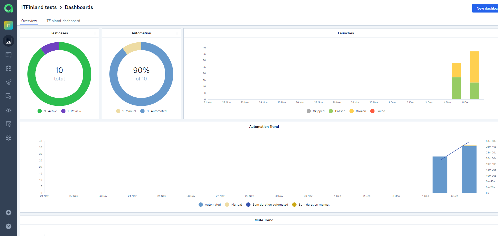
</p>

:arrow_right: List of launches:

<p align="center">
  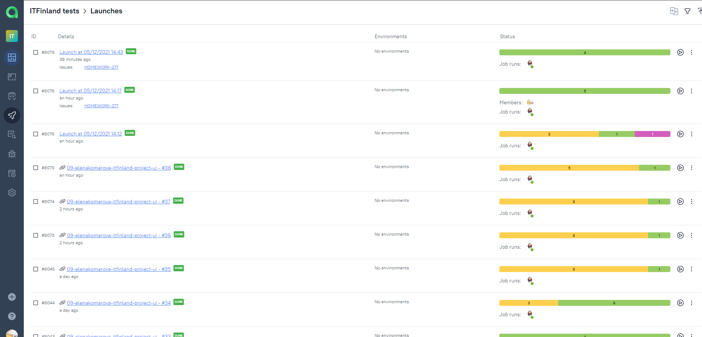
</p>

:arrow_right: List of tests grouped by features and their history of launches:

<p align="center">
  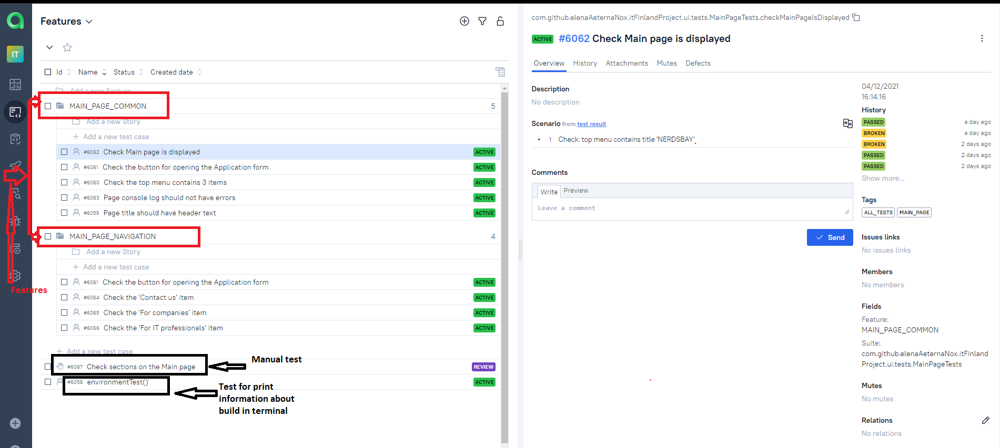
</p>

### Jira

Also Jira integration is realised in the project:

<p align="center">
  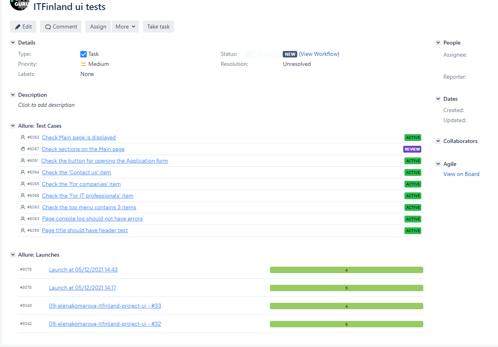
</p>


___

## Example of video with test running in Allure Report

You may look the example of video test running in Allure report

<p align="center">
  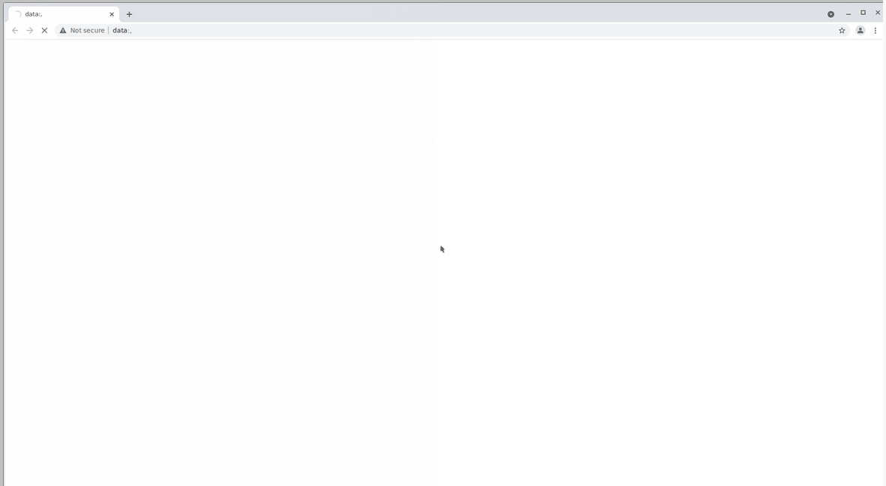
</p>


___

## Notifications in Telegram channel

The project is configured to send notifications about the results of launches from Jenkins to Telegram channel

<p align="center">
  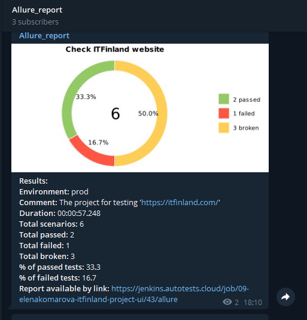
</p>

<p align="center">
  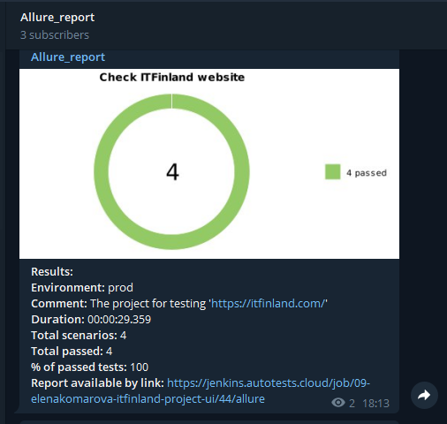
</p>


___
